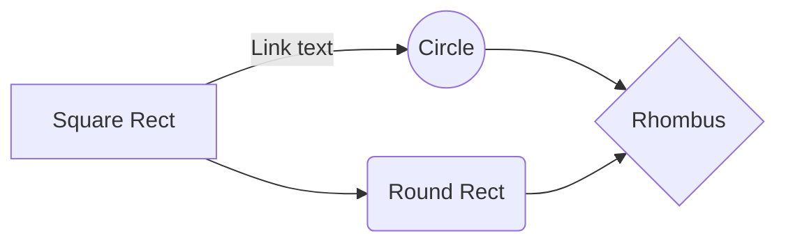

`MkDocs-Lab`

## Mermaid graphs

## References & Acknowledgements

- [The best MkDocs plugins and customizations](https://chrieke.medium.com/the-best-mkdocs-plugins-and-customizations-fc820eb19759)
- [MkDocs Plugins](https://github.com/mkdocs/mkdocs/wiki/MkDocs-Plugins)

> This article is protected by [CC BY-NC-SA 4.0](https://creativecommons.org/licenses/by/4.0/deed.en) agreement, should be reproduced with attribution.
