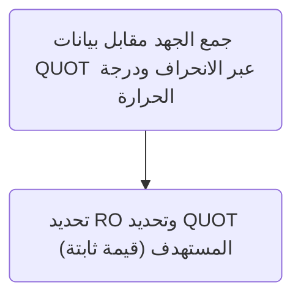
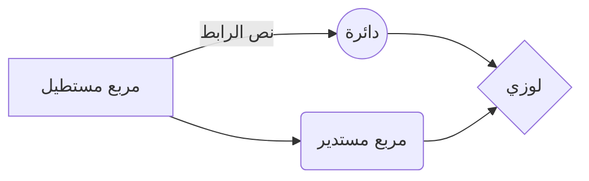
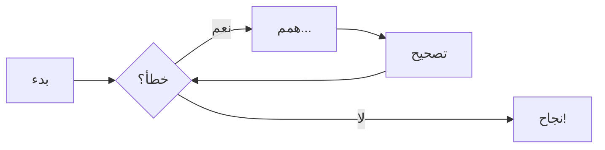
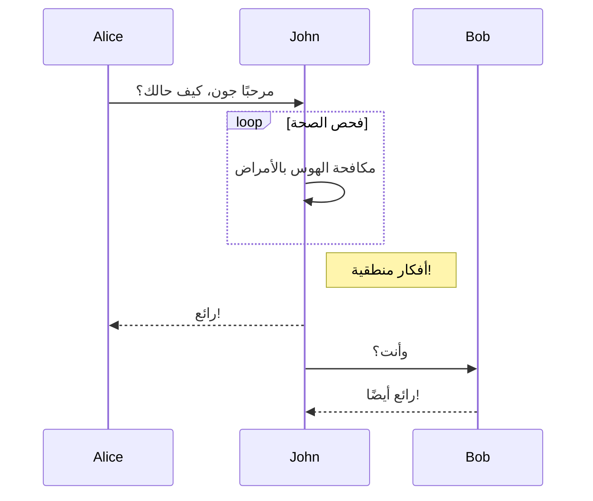
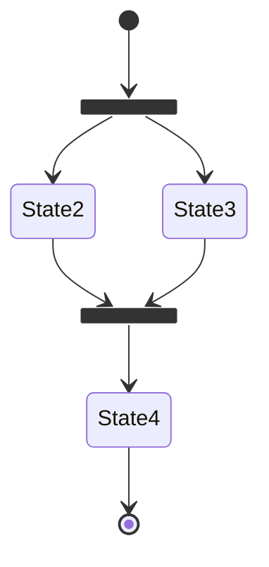

# مختبر اختبار MkDocs

`MkDocs-Lab`

<iframe frameborder="0" style="width:100%;height:393px;" src="https://viewer.diagrams.net/?tags=%7B%7D&highlight=0000ff&edit=_blank&layers=1&nav=1&title=1.drawio#R7VhZc9MwEP41Hp5gfKRO%2BojTpgVCB2ihw6NiK7aI7DWynINfzyqWYzsOOYD0yDQPGe16s5L2%2B%2FaIDacfz68ESaOPEFBu2GYwN5wLw7a7HRe%2FlWJRKM4su1CEggWFyqoUt%2BwX1UpTa3MW0KxhKAG4ZGlT6UOSUF82dEQImDXNxsCbu6YkpC3FrU94W3vPAhkV2p7drfTXlIVRubPlnhdPYlIa65tkEQlgVlM5l4bTFwCyWMXzPuUqdmVc7t8t7vlw4l69%2F5z9JF%2B9D3c3314XzgaH%2FGR1BUET%2BX9dayynhOc6XvquclEGUECeBFQ5MQ3Hi2TMcWnh8geVcqEBJ7kEVIGQEYSQED4ESLXdGBKpzSwl0yR4q4BFecTBnxSqAeNc74GStu%2BhlEkBkxV2ysEKCGXMyYhyj%2FiTcHnQPnAQ%2BCiBhCpXAZJB36U63GWl9faMrcYgg1z4dIudoylOREi3%2BdNZpc5X46lG7opCTKVYoIGgnEg2bZKZ6JwIV3YV7rjQ0B9AA6dFgyGJU5X1QLPklcTVDMRkCzcULrOISXqbkmWAZlhNmnyp8wCv6oWcZJlGcQfIh4E0pULS%2Bdawlk9dndu6uPW0OKsqhVWmf1SrEh3zSEB0WkB8x%2BL5kpL%2FkpLunilZdqydOanJUhJj7xTVnj4BS2TNBMbjDA%2B2Tp3Vhn%2FPprMWm26gRabdeDxruj0SmbqHccl68lxy%2F9AiXI5h8EYCV6FapTwPQyQLuksMZ9CuXRHEozzb3S4aGCsGDUjMuIrXNeVTKplPNjQVwlmI%2B174CDcVm8mDW7IkRMmtpLslWbH%2BHrHZdJvNZiXXu425odv0jtVtui1MPyF6BXS2yZf4nljHd%2Bw1EM4fu%2BX39inSz7oEP3jHL6vp7pZv7VmmNXvMNw5%2BGgR6%2BlPA%2BV4z5csYcByG2ac2CJQnrPHJy%2FmoPQmMcpEsBwHI5csksG0SsDc1oQedBMpCWAP1C00JQzDN4SnOAev%2F%2FDvOY88BZaVoQsBVTG2zyLATw2B9FnOs42GAYvWmtiiF1etu5%2FI3"></iframe>

## Mermaid











## المراجع والإعترافات

- [أفضل مكونات MkDocs وتخصيصاته](https://chrieke.medium.com/the-best-mkdocs-plugins-and-customizations-fc820eb19759)
- [مكونات MkDocs](https://github.com/mkdocs/mkdocs/wiki/MkDocs-Plugins)
- [الرسومات](https://squidfunk.github.io/mkdocs-material/reference/diagrams/)

> النص الأصلي: <https://wiki-power.com/>
> هذا المنشور محمي بموجب اتفاقية [CC BY-NC-SA 4.0](https://creativecommons.org/licenses/by/4.0/deed.ar) ويجب إعادة إنتاجه مع الإشارة إلى المصدر.
```

> تمت ترجمة هذه المشاركة باستخدام ChatGPT، يرجى [**تزويدنا بتعليقاتكم**](https://github.com/linyuxuanlin/Wiki_MkDocs/issues/new) إذا كانت هناك أي حذف أو إهمال.