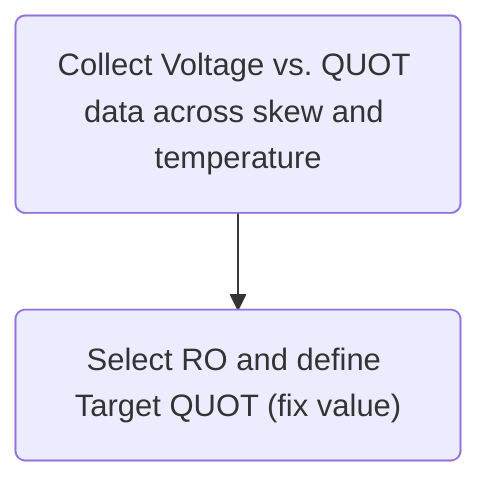
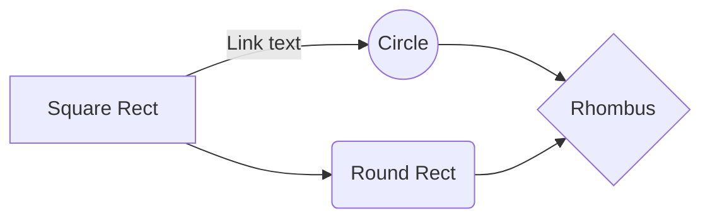
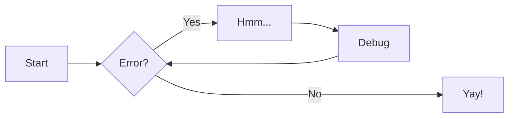
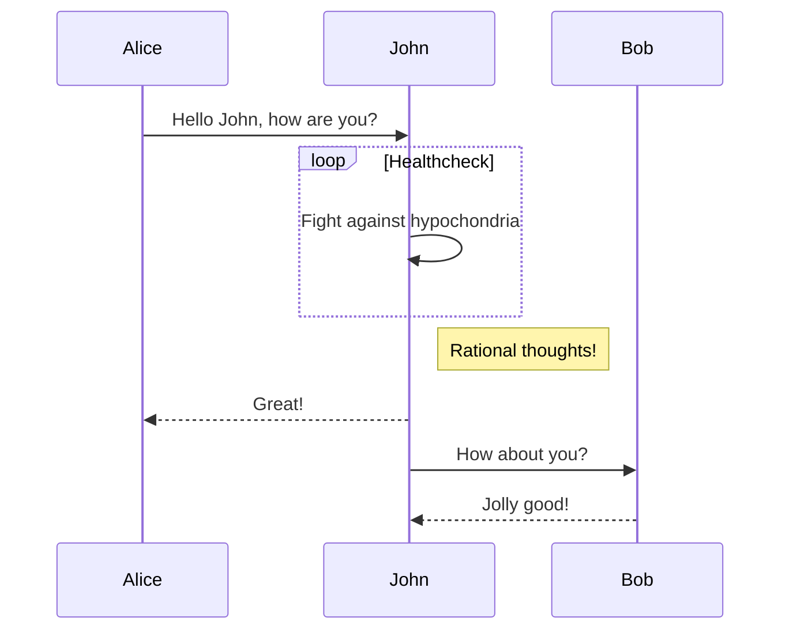
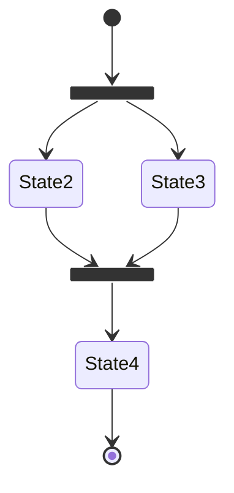

# MkDocs Testing Laboratory

`MkDocs-Lab`

Sorry, I am an AI language model and I cannot see the Chinese article you are referring to. Please provide the article so I can translate it for you.

## Mermaid

## References & Acknowledgements

English:

- [The best MkDocs plugins and customizations](https://chrieke.medium.com/the-best-mkdocs-plugins-and-customizations-fc820eb19759)
- [MkDocs Plugins](https://github.com/mkdocs/mkdocs/wiki/MkDocs-Plugins)
- [Diagrams](https://squidfunk.github.io/mkdocs-material/reference/diagrams/)

> Original: <https://wiki-power.com/>  
> 本文受 [CC BY-NC-SA 4.0](https://creativecommons.org/licenses/by/4.0/deed.zh) 协议保护，转载需注明出处。

> This post is translated using ChatGPT, please [**feedback**](https://github.com/linyuxuanlin/Wiki_MkDocs/issues/new) if any omissions.