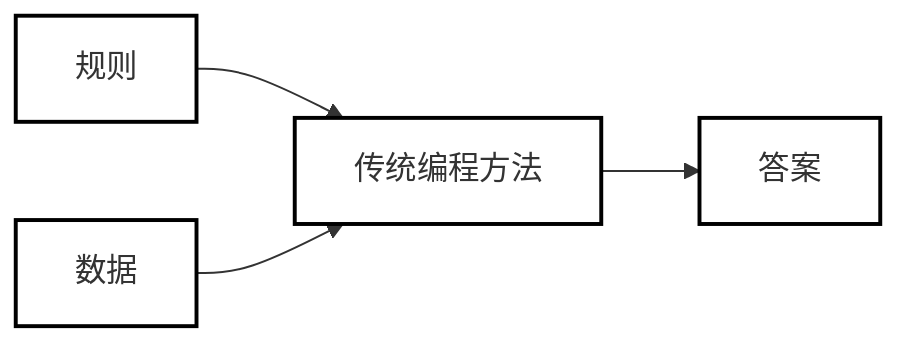
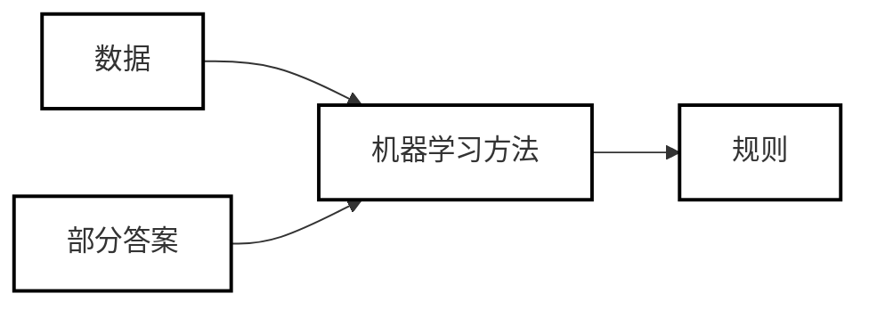

# 机器学习入门 - 基础流程

一般而言，传统的编程是告诉计算机一些数据以及计算规律，让计算机输出结果。当规则制定好之后，对于每一次输入，计算机输出的答案应该也是唯一确定的。

而机器学习的方法，是告诉计算机数据和一部分答案（标签），计算机输出答案与规律。这种方法是从已知答案的数据背后寻找某种规则。

机器学习的基本流程大致如下：

## 数据收集

机器学习就像「神农尝百草」，是一种归纳法（传统编程是演绎法）。而对于归纳法而言，数据是基础，越多越好。数据决定了机器学习的上限，而模型和算法再好，也只是逼近这个上限。

## 数据预处理

在最初的阶段，需要处理带标签的原始数据，形成用于训练和用于验证的数据集。这一步骤的主要的工作是特征提取和数据清洗。

特征提取是将特征提取出来，作为模型训练的输入。而数据清洗通常的流程有：

- **去除唯一属性**：唯一属性通常是一些 id 编码，这些属性不能刻画样本的分布规律。
- **处理缺失值**：可以选择直接补全缺失值，也可以直接删除含有这个属性的特征。
- **特征编码**：把文字或其他形式的特征转换为数字编码，方便模型处理。比如把 `ON`/`OFF` 编码为 `1`/`0`.
- **特征缩放**：通过归一化和标准化的手段，将样本属性缩放到某个指定的范围内，避免数量级差异大的属性占据主导地位。

## 模型的构建和训练

拥有可用的数据集之后，就可以根据需求选择合适的算法模型了。机器学习主要有三种方式：监督学习（Supervised Learning），无监督学习（Unsuoervised learing）和强化学习（RL, Reinforcement Learning）。

- **监督学习（Supervised Learning）**：监督意味着已经有标注好的数据集。通过已标注好的数据进行模型训练，从而利用训练好的模型来对新的数据进行预测。监督学习的应用一般分为 **回归** 和 **分类**：
  - 回归（Regression）：预测一个数字，有无限种可能的结果
  - 分类（Classification）：预测分类，只有两种或以上的少数选择，是拟合不同类别之间的分界线。
- **无监督学习（Unsuoervised learing）**：无需标注数据（有时候人也不知道问题的准确答案），应用一般有 **聚类**、**降维** 和 **异常检测（Anomaly Detection）** 这几种：
  - 聚类（Clustering）：例如给出一堆图片，把相似的图片划分到一起。
  - 降维（Dimensionality Reduction）：数据特征过多、维度过高时，要将数据降到合适的低维空间处理，保留最重要的特征数据。主要算法有主成分分析（PCA, Principal Component Analysis）。
- **强化学习（Reinforcement Learning, RL）**：把学习的过程作为一个试探评价的环节，会根据具体的环境得到反馈的强化信号（奖赏/惩罚）。让机器不断尝试，从而得到一种趋利避害的策略，形成一套解决问题的最优解。

我们可以对处理好的数据先做一个顶层的分析，是用监督学习还是无监督模型，问题的类型是属于分类还是回归。在实际选择时，也通常会选用不同的模型进行训练，然后比较输出结果并选择最佳的那个。

**模型训练的根本，是找到最合适的权重**，以最大限度地进行分类（分类问题中）、或使误差尽量小（回归问题中）。

我们以一个包含权重的公式为例：

$$
y=ax_1+bx_2+cx_3
$$

其中，$y$ 就是标签，在训练数据集中已经有正确的标注；而 $x_1, x_2, x_3$ 即特征值。举个实际的例子：

$$
花的种类=a*花蕊颜色+b*叶子颜色+c*花瓣颜色
$$

在这个阶段的工作，就是通过训练反推出权重 a、b、c，使得这条公式的结果尽量逼近原始输入数据。并且要设定损失函数（Loss Function），设法减小整体误差，实际中常使用均方误差（MSE, Mean Squared Error）来计算损失函数的误差。

## 模型评估

在上一个阶段把误差降到足够小后即可停止训练，用预处理后的测试数据集来验证模型效果。

## 预测

在上个阶段模型达到了预期的准确率和覆盖率（召回率）之后，就可以把模型拿来实际使用了。

---

入门机器学习要两手抓，一方面是算法基础，另一方面是代码练习。这样才能在学习中巩固，把理论基础转化为实际用途。

下一篇文章我们先介绍机器学习环境的配置。

---

## 参考与致谢

- Hands-On Machine Learning with Scikit-Learn, Keras, and TensorFlow, 3rd Edition (https://github.com/ageron/handson-ml3)
- 《程序员的 AI 书：从代码开始》
- 《AI 制胜：机器学习极简入门》
